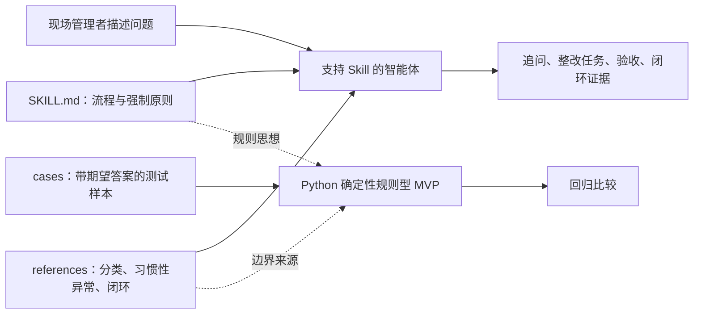

# Lean 6S Project Mastery Handbook Implementation Plan

> **For agentic workers:** REQUIRED SUB-SKILL: Use superpowers:subagent-driven-development (recommended) or superpowers:executing-plans to implement this plan task-by-task. Steps use checkbox (`- [ ]`) syntax for tracking.

**Goal:** Produce a private learning handbook that enables the project owner to explain the Lean 6S Skill’s product decisions, natural-language rule system, Python MVP, evaluation limits, AI-assisted coding boundary, and one small code change.

**Architecture:** Organize learning from business problem to product mechanism, then from pseudocode to actual Python functions and a traced example. Validate all function references against the AST of `lean_6s_mvp.py`, run every demonstration command, and finish with spoken 3-minute/10-minute interview practice plus a guided TDD change.

**Tech Stack:** Markdown, Mermaid, Python 3.11+ standard library (`ast`, `importlib`, `unittest`), existing `SKILL.md`, references, cases, and `scripts/lean_6s_mvp.py`.

## Global Constraints

- `case-study/mastery/` is private preparation material and must not enter the public site, PDF, or offline package.
- Explain the Skill and Python MVP as two related but different mechanisms.
- State that code was AI-assisted and that the owner led problem framing, workflow/rule design, evaluation, acceptance, and iteration.
- Never describe 31/31 as unknown-case accuracy or production validation.
- Every cited function name must exist in the current Python source.
- Every code example must run or be explicitly identified as pseudocode.
- Teach enough Python syntax to understand the project; do not turn the handbook into a general Python course.
- Learning is not marked complete until the user explains the project aloud and completes one guided TDD change.

---

## File Map

- Create `case-study/mastery/README.md`: learning sequence and completion criteria.
- Create `case-study/mastery/01-project-map.md`: file roles and two-mechanism architecture.
- Create `case-study/mastery/02-product-decisions.md`: why Skill, question gate, ledger-first, classification, and closure.
- Create `case-study/mastery/03-python-data-flow.md`: `main()` to `triage()` and downstream functions.
- Create `case-study/mastery/04-core-functions.md`: detailed function reading guide.
- Create `case-study/mastery/05-testing-and-limitations.md`: case parsing, regression, hard-coding, leakage, and future architecture.
- Create `case-study/mastery/06-guided-exercise.md`: one TDD modification walkthrough.
- Create `case-study/mastery/interview-q-and-a.md`: exact high-risk interview questions and answer frameworks.
- Create `case-study/mastery/three-minute-story.md`: concise project explanation.
- Create `case-study/mastery/ten-minute-story.md`: full case-study talk track.
- Create `case-study/mastery/progress.md`: evidence-based learning record.
- Create `scripts/validate_mastery_materials.py`: function/reference/claim/command validator.
- Create `tests/test_mastery_materials.py`: validator tests.
- Create or modify `tests/test_lean_6s_mvp.py`: guided TDD exercise test.
- Modify `scripts/lean_6s_mvp.py`: one user-completed object-inference rule during the exercise.

## Task 1: Establish the Handbook Contract and Validator

**Files:**
- Create: `case-study/mastery/README.md`
- Create: `scripts/validate_mastery_materials.py`
- Create: `tests/test_mastery_materials.py`

**Interfaces:**
- Consumes: current repository structure and `scripts/lean_6s_mvp.py`.
- Produces: `source_functions(path) -> set[str]`, `validate_materials(root) -> list[str]`, and a CLI that fails on missing modules, nonexistent function names, or overstated claims.

- [ ] **Step 1: Write failing validator tests**

Create `tests/test_mastery_materials.py`:

```python
import importlib.util
import tempfile
import unittest
from pathlib import Path


ROOT = Path(__file__).resolve().parents[1]
VALIDATOR = ROOT / "scripts" / "validate_mastery_materials.py"


def load_validator():
    spec = importlib.util.spec_from_file_location("validate_mastery_materials", VALIDATOR)
    module = importlib.util.module_from_spec(spec)
    assert spec.loader is not None
    spec.loader.exec_module(module)
    return module


class MasteryValidatorTests(unittest.TestCase):
    def setUp(self):
        self.module = load_validator()

    def test_source_function_inventory_contains_core_flow(self):
        functions = self.module.source_functions(ROOT / "scripts" / "lean_6s_mvp.py")
        self.assertTrue({"main", "triage", "classify", "habitual", "build_question_gate", "closure_check", "evaluate_cases"} <= functions)

    def test_overclaim_scan_rejects_false_authorship_and_validation(self):
        with tempfile.TemporaryDirectory() as directory:
            path = Path(directory) / "bad.md"
            path.write_text("我独立编写了全部代码，项目已通过真实用户验证并证明准确率100%。", encoding="utf-8")
            findings = self.module.find_overclaims([path])
        self.assertEqual(len(findings), 1)
        self.assertIn("独立编写了全部代码", findings[0])
```

- [ ] **Step 2: Run the tests and verify they fail**

Run:

```powershell
& 'C:\Users\邓志谦\.cache\codex-runtimes\codex-primary-runtime\dependencies\python\python.exe' -m unittest tests.test_mastery_materials.MasteryValidatorTests -v
```

Expected: FAIL because `validate_mastery_materials.py` does not exist.

- [ ] **Step 3: Implement the validator foundation**

Create `scripts/validate_mastery_materials.py`:

```python
#!/usr/bin/env python3
from __future__ import annotations

import ast
import re
from pathlib import Path
from typing import Iterable


ROOT = Path(__file__).resolve().parents[1]
MASTERY_ROOT = ROOT / "case-study" / "mastery"
REQUIRED_FILES = [
    "README.md",
    "01-project-map.md",
    "02-product-decisions.md",
    "03-python-data-flow.md",
    "04-core-functions.md",
    "05-testing-and-limitations.md",
    "06-guided-exercise.md",
    "interview-q-and-a.md",
    "three-minute-story.md",
    "ten-minute-story.md",
    "progress.md",
]
CORE_FUNCTIONS = {
    "main", "triage", "detect_location", "infer_object", "classify", "habitual",
    "closure_check", "build_question_gate", "build_actions", "acceptance",
    "parse_cases", "evaluate_cases"
}
OVERCLAIMS = [
    "独立编写了全部代码",
    "已通过真实用户验证",
    "证明准确率100%",
    "能够替代精益专家",
    "已经提升整改效率",
]


def source_functions(path: Path) -> set[str]:
    tree = ast.parse(path.read_text(encoding="utf-8"))
    return {node.name for node in ast.walk(tree) if isinstance(node, (ast.FunctionDef, ast.AsyncFunctionDef))}


def find_overclaims(paths: Iterable[Path]) -> list[str]:
    findings: list[str] = []
    for path in paths:
        text = path.read_text(encoding="utf-8")
        found = [claim for claim in OVERCLAIMS if claim in text]
        if found:
            findings.append(f"{path}: forbidden overclaims {found}")
    return findings


def referenced_functions(paths: Iterable[Path]) -> set[str]:
    names: set[str] = set()
    pattern = re.compile(r"`([a-z_][a-z0-9_]*)\(\)`")
    for path in paths:
        names.update(pattern.findall(path.read_text(encoding="utf-8")))
    return names


def validate_materials(root: Path = ROOT) -> list[str]:
    mastery = root / "case-study" / "mastery"
    errors = [f"missing mastery file: {name}" for name in REQUIRED_FILES if not (mastery / name).exists()]
    paths = [mastery / name for name in REQUIRED_FILES if (mastery / name).exists()]
    errors.extend(find_overclaims(paths))
    functions = source_functions(root / "scripts" / "lean_6s_mvp.py")
    unknown = referenced_functions(paths) - functions
    errors.extend(f"unknown function reference: {name}()" for name in sorted(unknown))
    missing_core = CORE_FUNCTIONS - functions
    errors.extend(f"core source function missing: {name}()" for name in sorted(missing_core))
    return errors


def main() -> None:
    errors = validate_materials()
    if errors:
        print("Mastery validation failed:")
        for error in errors:
            print(f"- {error}")
        raise SystemExit(1)
    print("Mastery validation passed: files, function references, and claim boundaries are valid.")


if __name__ == "__main__":
    main()
```

- [ ] **Step 4: Create the handbook landing page**

Create `case-study/mastery/README.md` with:

```markdown
# Lean 6S Improvement 项目掌握手册

这是一份私人学习材料，不随公开作品集发布。目标不是背诵代码，而是能够解释产品决策、核心数据流、评测边界和 AI 辅助编码中的个人贡献。

## 学习顺序

1. [项目地图](01-project-map.md)
2. [产品决策](02-product-decisions.md)
3. [Python 数据流](03-python-data-flow.md)
4. [核心函数](04-core-functions.md)
5. [测试与限制](05-testing-and-limitations.md)
6. [引导练习](06-guided-exercise.md)
7. [面试问答](interview-q-and-a.md)
8. [三分钟讲述](three-minute-story.md)
9. [十分钟讲述](ten-minute-story.md)

## 完成标准

- 不看材料讲清 Skill 与 Python MVP 的区别。
- 手动讲通一次 `triage()` 数据流。
- 解释至少五个产品决策及其证据。
- 说明 31/31 能证明和不能证明什么。
- 说明代码由 AI 辅助生成，个人主导问题、规则、评测、验收与迭代。
- 完成一次测试先行的小型代码修改并保持两套案例回归通过。
```

- [ ] **Step 5: Run validator unit tests**

Expected: the two unit tests PASS; full `validate_materials()` is allowed to report the remaining handbook files as missing until later tasks.

- [ ] **Step 6: Commit the handbook contract**

```powershell
git add case-study/mastery/README.md scripts/validate_mastery_materials.py tests/test_mastery_materials.py
git commit -m "docs: establish project mastery handbook"
```

## Task 2: Explain the Product and Two-Mechanism Architecture

**Files:**
- Create: `case-study/mastery/01-project-map.md`
- Create: `case-study/mastery/02-product-decisions.md`
- Modify: `tests/test_mastery_materials.py`

**Interfaces:**
- Consumes: `README.md`, `SKILL.md`, `references/*.md`, case libraries, and the approved design spec.
- Produces: a file-role map and five explainable product decisions.

- [ ] **Step 1: Write a failing content-contract test**

Append:

```python
class ProductLearningTests(unittest.TestCase):
    def test_project_map_distinguishes_skill_and_python_mvp(self):
        text = (ROOT / "case-study" / "mastery" / "01-project-map.md").read_text(encoding="utf-8")
        self.assertIn("自然语言规则系统", text)
        self.assertIn("确定性规则型 MVP", text)
        self.assertIn("不是 Skill 的完整运行引擎", text)

    def test_product_decisions_cover_five_required_choices(self):
        text = (ROOT / "case-study" / "mastery" / "02-product-decisions.md").read_text(encoding="utf-8")
        for phrase in ["为什么是 Skill", "追问决策关卡", "台账优先", "主分类与副分类", "闭环是质量判断"]:
            self.assertIn(phrase, text)
```

- [ ] **Step 2: Run the new tests and verify they fail**

Expected: FAIL because both learning modules are missing.

- [ ] **Step 3: Write the project map with an exact Mermaid diagram**

Create `01-project-map.md` with a diagram equivalent to:



Explain these exact roles:

- `SKILL.md`: natural-language workflow and behavior contract.
- `references/`: detailed knowledge boundaries loaded when relevant.
- `examples/cases*.md`: expected examples and regression fixtures, not production user data.
- `scripts/lean_6s_mvp.py`: deterministic rule-based MVP and regression helper, not the Skill’s full runtime.
- reports: evaluation evidence and iteration history.

Include a “一分钟自测” asking the learner to explain what would still work if the Python script were deleted and what would be lost.

- [ ] **Step 4: Write the five product-decision chapters**

Create `02-product-decisions.md`. Each decision uses the same four-part structure: observed problem, rejected alternative, chosen mechanism, remaining limitation.

Required decisions:

1. **为什么是 Skill**: distribution through an existing agent versus a standalone app and generic prompt.
2. **追问决策关卡**: ask at most three questions only when missing facts can change risk, classification, actions, or closure.
3. **台账优先**: optimize for copying into an operational ledger rather than producing long analysis.
4. **主分类与副分类**: one first control point plus only secondary categories that change action/evidence.
5. **闭环是质量判断**: current correction + standard/control + responsibility + recurrence evidence, not user assertion.

For each, cite the relevant repository file and include one interview-safe sentence in the learner’s own voice.

- [ ] **Step 5: Run content tests and verify they pass**

Run:

```powershell
& 'C:\Users\邓志谦\.cache\codex-runtimes\codex-primary-runtime\dependencies\python\python.exe' -m unittest tests.test_mastery_materials.ProductLearningTests -v
```

Expected: 2 tests PASS.

- [ ] **Step 6: Commit the product learning modules**

```powershell
git add case-study/mastery/01-project-map.md case-study/mastery/02-product-decisions.md tests/test_mastery_materials.py
git commit -m "docs: explain Lean 6S product decisions"
```

## Task 3: Teach the Python Data Flow and Core Functions

**Files:**
- Create: `case-study/mastery/03-python-data-flow.md`
- Create: `case-study/mastery/04-core-functions.md`
- Modify: `tests/test_mastery_materials.py`

**Interfaces:**
- Consumes: current `scripts/lean_6s_mvp.py` function signatures and behavior.
- Produces: one accurate end-to-end trace and function-by-function reading guide.

- [ ] **Step 1: Write failing tests for function coverage**

Append:

```python
class CodeLearningTests(unittest.TestCase):
    def test_data_flow_covers_triage_call_order(self):
        text = (ROOT / "case-study" / "mastery" / "03-python-data-flow.md").read_text(encoding="utf-8")
        order = ["`classify()`", "`detect_location()`", "`infer_object()`", "`habitual()`", "`closure_check()`", "`build_question_gate()`", "`build_actions()`", "`acceptance()`"]
        positions = [text.index(item) for item in order]
        self.assertEqual(positions, sorted(positions))

    def test_core_function_guide_names_known_technical_debt(self):
        text = (ROOT / "case-study" / "mastery" / "04-core-functions.md").read_text(encoding="utf-8")
        self.assertIn("硬编码", text)
        self.assertIn("关键词计分", text)
        self.assertIn("正则", text)
        self.assertIn("测试集泄漏", text)
```

- [ ] **Step 2: Run tests and verify they fail**

Expected: FAIL because both modules are missing.

- [ ] **Step 3: Write the end-to-end data-flow module**

Create `03-python-data-flow.md` with:

1. CLI path: `main()` parses `--problem`, `--rectified-text`, `--case-file`, `--test-cases`, `--pretty`.
2. Single issue path: `main()` calls `triage()` and serializes the `Triage` dataclass with `asdict()`.
3. Exact `triage()` call order: `classify()` → `detect_location()` → `infer_object()` → `habitual()` → `closure_check()` → `build_question_gate()` → optionally `build_actions()` and `acceptance()`.
4. Regression path: `parse_cases()` → `evaluate_cases()` → `triage()` → expected/actual comparison.

Trace this actual command:

```powershell
& 'C:\Users\邓志谦\.cache\codex-runtimes\codex-primary-runtime\dependencies\python\python.exe' scripts\lean_6s_mvp.py --problem "包装区消防通道又被6个托盘占用，上周清理后再次出现" --pretty
```

For every output field, identify the producing function. Explain that `needs_clarification` suppresses actions only when the question gate requires an answer and primary classification remains `Unknown`; known safety cases may still receive provisional actions.

- [ ] **Step 4: Write the core-function guide**

Create `04-core-functions.md` with one section per function:

- `score_category()`: counts substring matches; no semantic embeddings.
- `classify()`: checks case-specific rules, boundary rules, then keyword scoring fallback.
- `habitual()`: checks special cases, strong/weak signals, and one-time exclusions.
- `build_question_gate()`: constructs `must_ask` and `nice_to_have`, caps each at three, and produces status/confidence/reason.
- `closure_check()`: checks explicit verdict, fake-closure terms, conditional evidence, and evidence counts.
- `build_actions()` and `acceptance()`: return category-based templates.
- `parse_cases()`: uses regex to read Markdown sections.
- `evaluate_cases()`: strips the explicit closure verdict before testing and compares four expected fields.

For every section include: signature, inputs, output, one branch example, why it exists, and technical debt. Do not claim the functions perform root-cause analysis or understand images.

- [ ] **Step 5: Run the example command and capture actual output excerpts**

Run the command above. Copy only the relevant output fields into the guide and verify they match the current script. If the result differs from the expected teaching narrative, update the narrative rather than altering code to make the guide look cleaner.

- [ ] **Step 6: Run content and validator tests**

Run:

```powershell
& 'C:\Users\邓志谦\.cache\codex-runtimes\codex-primary-runtime\dependencies\python\python.exe' -m unittest tests.test_mastery_materials.CodeLearningTests -v
& 'C:\Users\邓志谦\.cache\codex-runtimes\codex-primary-runtime\dependencies\python\python.exe' scripts\validate_mastery_materials.py
```

The full validator may still report later modules as missing, but it must report zero unknown function references in the files created so far.

- [ ] **Step 7: Commit the code learning modules**

```powershell
git add case-study/mastery/03-python-data-flow.md case-study/mastery/04-core-functions.md tests/test_mastery_materials.py
git commit -m "docs: teach Lean 6S Python data flow"
```

## Task 4: Explain Evaluation Limits and Future Architecture

**Files:**
- Create: `case-study/mastery/05-testing-and-limitations.md`
- Modify: `tests/test_mastery_materials.py`

**Interfaces:**
- Consumes: `docs/case-validation.md`, both case libraries, model comparison reports, synthetic-test results, and current Python source.
- Produces: a defensible explanation of evidence strength and next architecture.

- [ ] **Step 1: Write a failing evidence-boundary test**

Append:

```python
class EvaluationLearningTests(unittest.TestCase):
    def test_limitations_state_what_31_over_31_cannot_prove(self):
        text = (ROOT / "case-study" / "mastery" / "05-testing-and-limitations.md").read_text(encoding="utf-8")
        for phrase in ["现有案例一致性", "不能证明未知问题", "硬编码", "测试集泄漏", "合成用户测试", "真实用户研究"]:
            self.assertIn(phrase, text)
```

- [ ] **Step 2: Run the test and verify it fails**

Expected: FAIL because the module is missing.

- [ ] **Step 3: Write the testing and limitation module**

Create `05-testing-and-limitations.md` with:

- A table separating case regression, with/without Skill comparison, cross-model evaluation, mentor feedback, synthetic-user testing, and future real-user testing.
- The exact four fields checked by `evaluate_cases()`.
- Why stripping the explicit “判定” line reduces one obvious leakage path but does not remove rule/case co-evolution.
- Why case-specific branches near the top of `classify()` can produce 31/31 while generalization remains unknown.
- Why synthetic personas help discover interaction problems but cannot measure human satisfaction or field outcomes.
- A future hybrid architecture:
  1. LLM extracts facts and uncertainty into a schema.
  2. Deterministic validators enforce required fields, safety gates, and closure evidence.
  3. Retrieval supplies scenario-specific Lean knowledge.
  4. Human/EHS approval is required for high-risk closure.
  5. Real usage data supports separate train, validation, and holdout sets.

End with an interview-safe answer to “既然有硬编码，这个项目还有价值吗？” that distinguishes prototype learning value from production readiness.

- [ ] **Step 4: Run the evaluation test and existing case regressions**

Run:

```powershell
& 'C:\Users\邓志谦\.cache\codex-runtimes\codex-primary-runtime\dependencies\python\python.exe' -m unittest tests.test_mastery_materials.EvaluationLearningTests -v
& 'C:\Users\邓志谦\.cache\codex-runtimes\codex-primary-runtime\dependencies\python\python.exe' scripts\lean_6s_mvp.py --case-file examples\cases.md --test-cases --pretty
& 'C:\Users\邓志谦\.cache\codex-runtimes\codex-primary-runtime\dependencies\python\python.exe' scripts\lean_6s_mvp.py --case-file examples\cases2.md --test-cases --pretty
```

Expected: learning test PASS and both current regression suites remain fully passing.

- [ ] **Step 5: Commit the evaluation module**

```powershell
git add case-study/mastery/05-testing-and-limitations.md tests/test_mastery_materials.py
git commit -m "docs: explain evaluation limits and future architecture"
```

## Task 5: Complete a Guided TDD Code Change

**Files:**
- Create: `case-study/mastery/06-guided-exercise.md`
- Create or modify: `tests/test_lean_6s_mvp.py`
- Modify: `scripts/lean_6s_mvp.py`

**Interfaces:**
- Consumes: `infer_object(text: str) -> str` and current regression suites.
- Produces: support for recognizing “清洁剂” as the affected object and a learner-owned TDD experience.

- [ ] **Step 1: Write the exercise explanation before changing code**

Create `06-guided-exercise.md` explaining this observed gap:

```text
输入：配电柜前放了两桶清洁剂。
当前分类可以因“配电柜”识别为安全，但 infer_object() 的候选对象没有“清洁剂”，因此 affected_object 可能为 Unknown，并触发不必要的对象追问。
```

Explain the TDD loop: predict → failing test → minimal change → focused test → both case regressions → reflection.

- [ ] **Step 2: Create the progress record and ask the user to predict the current output**

Create `case-study/mastery/progress.md` with dated columns for module, activity, observed result, remaining confusion, and next review. Before running code, ask which fields are likely to be `Safety / 安全`, `配电柜`, and `Unknown`. Record the learner’s prediction and the actual result; do not invent a correct answer on the learner’s behalf.

- [ ] **Step 3: Write the failing test**

Create `tests/test_lean_6s_mvp.py` with:

```python
import importlib.util
import sys
import unittest
from pathlib import Path


ROOT = Path(__file__).resolve().parents[1]
MODULE_PATH = ROOT / "scripts" / "lean_6s_mvp.py"


def load_mvp():
    spec = importlib.util.spec_from_file_location("lean_6s_mvp", MODULE_PATH)
    module = importlib.util.module_from_spec(spec)
    assert spec.loader is not None
    sys.modules[spec.name] = module
    spec.loader.exec_module(module)
    return module


class ObjectInferenceTests(unittest.TestCase):
    def test_infer_object_recognizes_cleaning_agent(self):
        module = load_mvp()
        self.assertEqual(module.infer_object("配电柜前放了两桶清洁剂"), "清洁剂")


if __name__ == "__main__":
    unittest.main()
```

- [ ] **Step 4: Run the focused test and verify it fails**

Run:

```powershell
& 'C:\Users\邓志谦\.cache\codex-runtimes\codex-primary-runtime\dependencies\python\python.exe' -m unittest tests.test_lean_6s_mvp.ObjectInferenceTests -v
```

Expected: FAIL because actual value is `Unknown`.

- [ ] **Step 5: Let the user make or explain the minimal code change**

In `infer_object()`, add `"清洁剂"` to `candidates` beside other Chinese object terms. Do not alter classification, risk, actions, or acceptance logic.

- [ ] **Step 6: Re-run focused and regression tests**

Run:

```powershell
& 'C:\Users\邓志谦\.cache\codex-runtimes\codex-primary-runtime\dependencies\python\python.exe' -m unittest tests.test_lean_6s_mvp.ObjectInferenceTests -v
& 'C:\Users\邓志谦\.cache\codex-runtimes\codex-primary-runtime\dependencies\python\python.exe' scripts\lean_6s_mvp.py --case-file examples\cases.md --test-cases --pretty
& 'C:\Users\邓志谦\.cache\codex-runtimes\codex-primary-runtime\dependencies\python\python.exe' scripts\lean_6s_mvp.py --case-file examples\cases2.md --test-cases --pretty
```

Expected: focused test PASS; both regression suites remain fully passing.

- [ ] **Step 7: Add the reflection questions**

Complete `06-guided-exercise.md` with answers the learner supplies for:

- Why did this change belong in `infer_object()` rather than `classify()`?
- Why is one passing unit test insufficient for production generalization?
- What new variants such as “清洗剂” or “化学清洁剂” reveal about keyword rules?
- How would structured LLM extraction reduce this maintenance burden?

- [ ] **Step 8: Commit the learner-owned change**

```powershell
git add case-study/mastery/06-guided-exercise.md case-study/mastery/progress.md tests/test_lean_6s_mvp.py scripts/lean_6s_mvp.py
git commit -m "test: teach object inference with guided TDD"
```

## Task 6: Build Interview Stories and Complete the Spoken Gate

**Files:**
- Create: `case-study/mastery/interview-q-and-a.md`
- Create: `case-study/mastery/three-minute-story.md`
- Create: `case-study/mastery/ten-minute-story.md`
- Create or modify: `case-study/mastery/progress.md`
- Modify: `tests/test_mastery_materials.py`

**Interfaces:**
- Consumes: public case-study copy and all learning modules.
- Produces: accurate interview narratives and a real progress record.

- [ ] **Step 1: Write a failing interview-boundary test**

Append:

```python
class InterviewMaterialTests(unittest.TestCase):
    def test_interview_materials_disclose_ai_assistance_and_limits(self):
        mastery = ROOT / "case-study" / "mastery"
        text = "\n".join((mastery / name).read_text(encoding="utf-8") for name in [
            "interview-q-and-a.md", "three-minute-story.md", "ten-minute-story.md"
        ])
        self.assertIn("AI 辅助", text)
        self.assertIn("31 条现有案例", text)
        self.assertIn("不能证明", text)
        self.assertIn("真实用户", text)
```

- [ ] **Step 2: Create the exact interview question set**

Create `interview-q-and-a.md` with answer frameworks for:

1. 你为什么选择 Skill，而不是独立 App？
2. 通用提示词与 Skill 的差异是什么？
3. 追问关卡解决了什么问题？
4. 为什么要区分主分类和副分类？
5. 31/31 能证明什么，不能证明什么？
6. 合成用户测试为什么不能算真实用户研究？
7. 代码是 AI 写的，你具体贡献了什么？
8. Python MVP 与真正运行的 Skill 是什么关系？
9. 当前最大的技术债是什么？
10. 如果进入下一阶段，你如何做真实用户测试？
11. 如果要产品化，你会怎样改架构？
12. 这个项目失败过什么，你从中学到了什么？

Each answer uses: conclusion → evidence → limitation → next step. Do not script exaggerated confidence; include one follow-up challenge per question.

- [ ] **Step 3: Write the 3-minute story**

Use five timed blocks:

- 0:00–0:30 user problem.
- 0:30–1:00 why Skill.
- 1:00–1:45 key workflow and question gate.
- 1:45–2:30 evaluation and iteration.
- 2:30–3:00 result, limitation, and personal contribution.

At natural speaking speed, keep the Chinese script between 600 and 850 characters.

- [ ] **Step 4: Write the 10-minute story**

Follow the public site’s nine chapters, spending most time on early failure, question-gate/ledger-first decisions, and evidence limits. Include cues for when to show the workflow, Before/Insight/Decision/After module, and evaluation chart. Keep the script between 2,000 and 3,200 Chinese characters.

- [ ] **Step 5: Create the progress record without fabricated completion**

Update `progress.md` with dated rows for modules reviewed, self-explanation result, TDD exercise result, remaining confusion, and next review. Preserve the prediction and exercise record from Task 5. Use “未检查” only for activities that have not actually occurred, and update them only during real sessions with the user.

- [ ] **Step 6: Run all mastery tests and validator**

Run:

```powershell
& 'C:\Users\邓志谦\.cache\codex-runtimes\codex-primary-runtime\dependencies\python\python.exe' -m unittest tests.test_mastery_materials -v
& 'C:\Users\邓志谦\.cache\codex-runtimes\codex-primary-runtime\dependencies\python\python.exe' scripts\validate_mastery_materials.py
```

Expected: all tests PASS and validator reports no missing files, unknown functions, or overclaims.

- [ ] **Step 7: Conduct the spoken gate with the user**

Ask the user to deliver the three-minute story without reading. Then ask them to explain `triage()` from input to output and answer questions 5, 7, and 9. Record concrete gaps and schedule another pass when needed; do not mark complete because the written materials exist.

- [ ] **Step 8: Commit the completed mastery materials**

```powershell
git add case-study/mastery tests/test_mastery_materials.py scripts/validate_mastery_materials.py
git commit -m "docs: complete Lean 6S interview mastery materials"
```
